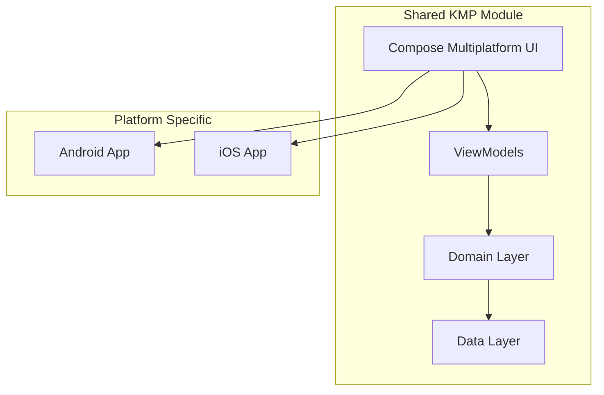
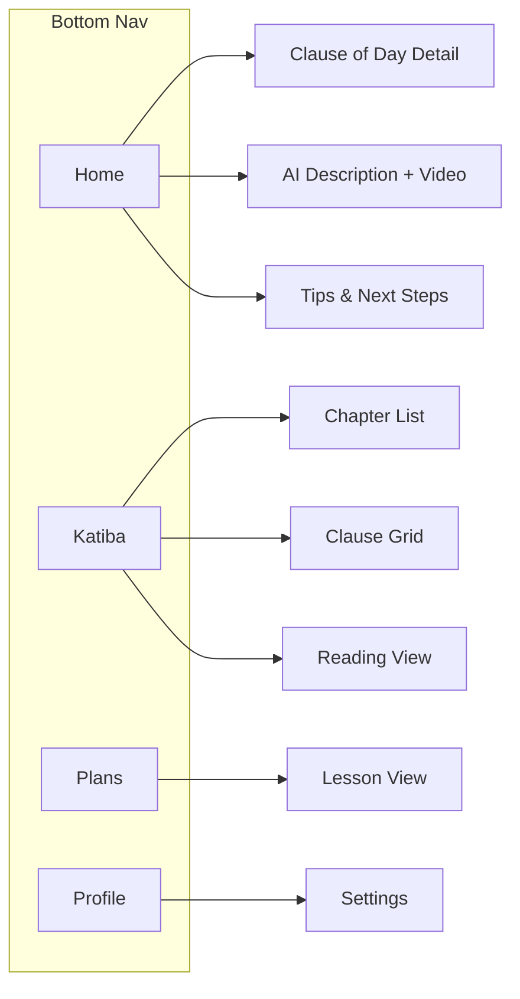

# Katiba - Kenyan Constitution Civic Education App

A Kotlin Multiplatform application designed to enhance civic education among Kenyan citizens by providing an engaging, modern platform to learn the Kenyan Constitution.

## Visual Inspiration

The app draws design inspiration from the provided reference images:

````carousel

<!-- slide -->

<!-- slide -->

<!-- slide -->

<!-- slide -->

<!-- slide -->

<!-- slide -->

<!-- slide -->

````

---

## User Review Required

> [!IMPORTANT]
> **Technology Choice**: This plan uses **Compose Multiplatform** for shared UI across Android and iOS. Please confirm this is acceptable, or if you prefer platform-native UIs with shared business logic only.

> [!IMPORTANT]
> **Backend Integration**: The plan includes placeholder data structures. Will there be a backend API for:
> - Daily clause content from admins?
> - Video uploads for civic educators?
> - AI-generated descriptions (Gemini/OpenAI integration)?

> [!WARNING]
> **iOS Development**: Building for iOS requires a Mac with Xcode. Please confirm if iOS is a priority or if we should focus on Android first.

---

## Proposed Architecture



---

## Proposed Changes

### Project Structure

#### [NEW] Root project configuration
```
katiba/
├── composeApp/
│   ├── src/
│   │   ├── commonMain/           # Shared Compose UI & business logic
│   │   │   ├── kotlin/
│   │   │   │   └── com/katiba/
│   │   │   │       ├── ui/
│   │   │   │       │   ├── theme/
│   │   │   │       │   ├── navigation/
│   │   │   │       │   ├── home/
│   │   │   │       │   ├── constitution/
│   │   │   │       │   ├── plans/
│   │   │   │       │   ├── profile/
│   │   │   │       │   └── components/
│   │   │   │       ├── domain/
│   │   │   │       └── data/
│   │   │   └── resources/        # Shared resources
│   │   ├── androidMain/          # Android specific code
│   │   └── iosMain/              # iOS specific code
│   └── build.gradle.kts
├── iosApp/                       # iOS app entry point
├── gradle/
├── build.gradle.kts
└── settings.gradle.kts
```

---

### Design System & Theme

#### [NEW] [KatibaTheme.kt](file:///d:/ProjectDev/katiba/composeApp/src/commonMain/kotlin/com/katiba/ui/theme/KatibaTheme.kt)

Kenyan-themed design system with:

| Element | Color | Usage |
|---------|-------|-------|
| Primary Black | `#000000` | Headers, text, primary actions |
| Kenya Red | `#BB0000` | Accents, highlights, active states |
| Kenya Green | `#006600` | Success states, progress, CTAs |
| White | `#FFFFFF` | Backgrounds, cards |
| Warm Brown | `#8B4513` | Beadwork accent, secondary elements |

**Cultural Elements:**
- Shield-inspired icon shapes
- Beadwork pattern borders on cards
- Spear/arrow progress indicators

#### [NEW] [Type.kt](file:///d:/ProjectDev/katiba/composeApp/src/commonMain/kotlin/com/katiba/ui/theme/Type.kt)

Typography system using clean, readable fonts suitable for legal text.

---

### Navigation

#### [NEW] [Navigation.kt](file:///d:/ProjectDev/katiba/composeApp/src/commonMain/kotlin/com/katiba/ui/navigation/Navigation.kt)

Bottom navigation with 4 tabs:

| Tab | Icon | Screen |
|-----|------|--------|
| Home | 🏠 | Daily clause cards |
| Katiba | 📖 | Constitution reader |
| Plans | 🎯 | Learning path |
| Profile | 👤 | User profile |



---

### Home Tab Screens

#### [NEW] [HomeScreen.kt](file:///d:/ProjectDev/katiba/composeApp/src/commonMain/kotlin/com/katiba/ui/home/HomeScreen.kt)

YouVersion-inspired home with 3 cards:

1. **Clause of the Day Card** - Hero card with today's constitutional clause
2. **AI Description Card** - AI-powered explanation + video preview
3. **Tips & Actions Card** - Practical application tips

#### [NEW] [ClauseOfDayDetailScreen.kt](file:///d:/ProjectDev/katiba/composeApp/src/commonMain/kotlin/com/katiba/ui/home/ClauseOfDayDetailScreen.kt)

Single-page focused view of the clause with:
- Full clause text
- Chapter/Section reference
- Share button
- Bookmark option

#### [NEW] [AIDescriptionScreen.kt](file:///d:/ProjectDev/katiba/composeApp/src/commonMain/kotlin/com/katiba/ui/home/AIDescriptionScreen.kt)

Multi-page view with **horizontal swipe/tap navigation**:

| Page | Content |
|------|---------|
| 1 | AI-generated text explanation (vertical scroll) |
| 2 | Civic educator video (reel format) |

Navigation: Tap left/right sides of screen to switch pages.

#### [NEW] [TipsScreen.kt](file:///d:/ProjectDev/katiba/composeApp/src/commonMain/kotlin/com/katiba/ui/home/TipsScreen.kt)

Multi-page view with horizontal navigation:

| Page | Content |
|------|---------|
| 1 | AI-powered next steps |
| 2 | Daily life application tips |

---

### Constitution Tab (Bible Reader Style)

#### [NEW] [ConstitutionScreen.kt](file:///d:/ProjectDev/katiba/composeApp/src/commonMain/kotlin/com/katiba/ui/constitution/ConstitutionScreen.kt)

Main reader screen with:
- Top toolbar (audio, search, settings)
- Chapter title display
- Article/Clause number
- Scrollable text content
- Bottom navigation bar for chapter switching

#### [NEW] [ChapterListScreen.kt](file:///d:/ProjectDev/katiba/composeApp/src/commonMain/kotlin/com/katiba/ui/constitution/ChapterListScreen.kt)

List of all chapters in the constitution:
- Preamble
- Chapter One: Sovereignty of the People
- Chapter Two: The Republic
- ... (all 18 chapters)
- Schedules

#### [NEW] [ClauseGridScreen.kt](file:///d:/ProjectDev/katiba/composeApp/src/commonMain/kotlin/com/katiba/ui/constitution/ClauseGridScreen.kt)

Grid view of clauses within a chapter (similar to Bible verse grid):
- Intro button
- Numbered clause buttons (1-264)
- Quick navigation

---

### Plans Tab (Duolingo Style)

#### [NEW] [PlansScreen.kt](file:///d:/ProjectDev/katiba/composeApp/src/commonMain/kotlin/com/katiba/ui/plans/PlansScreen.kt)

Learning path with:
- Vertical progress path
- Milestone nodes (shield-shaped for Kenyan theme)
- Completed/Current/Locked states
- Streak counter

**Learning Structure:**
```
📕 Preamble
    ├── Lesson 1: We the People
    └── Lesson 2: Core Values
    
📗 Chapter 1: Sovereignty
    ├── Lesson 3: Sovereignty of the People
    └── Lesson 4: Defence of the Constitution
    
... (continues through constitution)
```

#### [NEW] [LessonScreen.kt](file:///d:/ProjectDev/katiba/composeApp/src/commonMain/kotlin/com/katiba/ui/plans/LessonScreen.kt)

Interactive lesson with:
- Bite-sized content chunks
- Quiz questions
- Progress indicator
- XP/Points earned

---

### Profile Tab

#### [NEW] [ProfileScreen.kt](file:///d:/ProjectDev/katiba/composeApp/src/commonMain/kotlin/com/katiba/ui/profile/ProfileScreen.kt)

User profile with cards for:

| Card | Content |
|------|---------|
| Bio | Name, avatar, joined date |
| Residence | County, constituency |
| Streak | Current streak, longest streak, fire icon |
| Badges | Achievement badges earned |
| Activity | Recent learning activity |

**Top-right cog icon → Settings**

#### [NEW] [SettingsScreen.kt](file:///d:/ProjectDev/katiba/composeApp/src/commonMain/kotlin/com/katiba/ui/profile/SettingsScreen.kt)

Settings sections:
- Account
- Notifications
- Display preferences
- Language (English/Swahili)
- About

---

### Data Layer

#### [NEW] [ConstitutionData.kt](file:///d:/ProjectDev/katiba/composeApp/src/commonMain/kotlin/com/katiba/data/ConstitutionData.kt)

```kotlin
data class Chapter(
    val number: Int,
    val title: String,
    val articles: List<Article>
)

data class Article(
    val number: Int,
    val title: String,
    val clauses: List<Clause>
)

data class Clause(
    val number: String,
    val text: String,
    val subClauses: List<String>
)
```

#### [NEW] [DailyContent.kt](file:///d:/ProjectDev/katiba/composeApp/src/commonMain/kotlin/com/katiba/data/DailyContent.kt)

```kotlin
data class DailyContent(
    val date: LocalDate,
    val clause: Clause,
    val aiDescription: String,
    val videoUrl: String,
    val nextSteps: List<String>,
    val tips: List<String>
)
```

#### [NEW] [UserProfile.kt](file:///d:/ProjectDev/katiba/composeApp/src/commonMain/kotlin/com/katiba/data/UserProfile.kt)

```kotlin
data class UserProfile(
    val id: String,
    val name: String,
    val county: String,
    val constituency: String,
    val streak: Int,
    val badges: List<Badge>,
    val progress: LearningProgress
)
```

---

### Shared UI Components

#### [NEW] [KatibaCard.kt](file:///d:/ProjectDev/katiba/composeApp/src/commonMain/kotlin/com/katiba/ui/components/KatibaCard.kt)

Reusable card component with beadwork-inspired border pattern.

#### [NEW] [ShieldIcon.kt](file:///d:/ProjectDev/katiba/composeApp/src/commonMain/kotlin/com/katiba/ui/components/ShieldIcon.kt)

Kenyan shield-shaped icon/button component.

#### [NEW] [ProgressIndicator.kt](file:///d:/ProjectDev/katiba/composeApp/src/commonMain/kotlin/com/katiba/ui/components/ProgressIndicator.kt)

Spear/arrow-themed progress indicator.

#### [NEW] [PageIndicator.kt](file:///d:/ProjectDev/katiba/composeApp/src/commonMain/kotlin/com/katiba/ui/components/PageIndicator.kt)

Dot indicator for multi-page views.

---

## Verification Plan

### Automated Tests

```bash
# Build and run on Android
./gradlew :composeApp:assembleDebug
./gradlew :composeApp:installDebug

# Run unit tests
./gradlew :composeApp:testDebugUnitTest

# Check iOS build (Mac only)
./gradlew :composeApp:linkDebugFrameworkIosSimulatorArm64
```

### Manual Verification

| Test Case | Expected Result |
|-----------|-----------------|
| Bottom nav switching | All 4 tabs navigate correctly |
| Home card taps | Each card opens correct detail view |
| Multi-page navigation | Left/right taps switch pages |
| Constitution reader | Chapters and clauses load correctly |
| Plans progress | Lessons show correct completion state |
| Profile settings | Cog icon opens settings screen |
| Theme consistency | Kenyan colors applied throughout |

### Browser Testing (Web target if added)

Will use browser subagent to test web version if multiplatform web is included.
